# Generador de paletas aleatorio - Proyecto Integrador M1

Página web estática e interactiva que genera paletas de colores aleatorias de entre 6, 8 o 9 colores en formatos HEX y/o HSL.

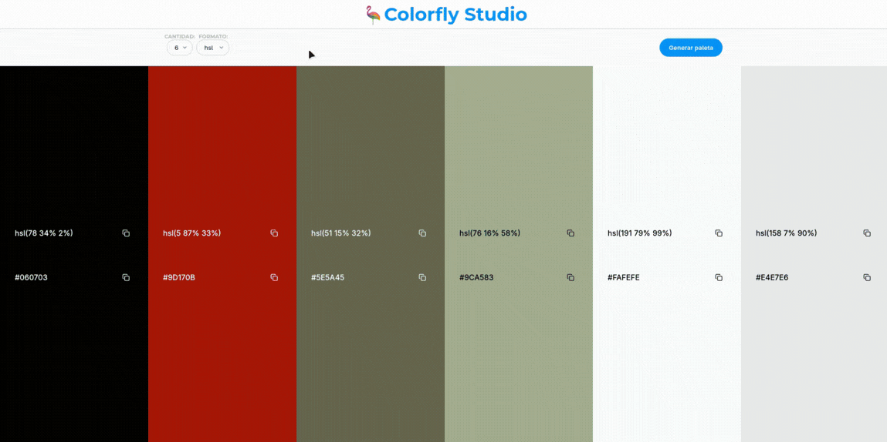

🌐 Demo: [https://fermop.github.io/ProyectoM1_FernandoPerezMojica/](https://fermop.github.io/ProyectoM1_FernandoPerezMojica/)

---

## Contenido

- [Consigna](#consigna)
  - [Extras](#extras)
- [Instrucciones de uso](#instrucciones-de-uso)
- [Desiciones técnicas](#decisiones-técnicas)
- [Pasos para ejecutar la aplicación en local](#pasos-para-ejecutar-la-aplicación-en-local)
- [Pasos para desplegar la aplicación en GitHub](#pasos-para-desplegar-la-aplicación-en-github)
- [Fuentes útiles](#fuentes-útiles)

---

## Consigna

Detalle:

- [x] Seleccionar el tamaño de la paleta (6, 8 o 9 colores).
- [x] Generar colores aleatorios en dos formatos: HSL y HEX/RGBA (elegir uno de estos últimos).
- [x] Visualizar cada color junto a su código HEX.
- [x] Funcionar correctamente en desktop

Alcance funcional mínimo (obligatorio). Para considerar el challenge completo, la aplicación debe cumplir con todos los siguientes puntos:

- [x] Botón “Generar paleta” operativo.
- [x] Generación correcta de colores aleatorios. 
- [x] Render dinámico según el tamaño seleccionado.
- [x] Microfeedback visible (tooltip, toast u otro equivalente).
- [x] Uso de HTML semántico.
- [x] Consideraciones básicas de accesibilidad (labels asociados, contraste suficiente, foco visible).

Tech Stack necesario:
- [x] HTML
- [x] CSS
- [x] JavaScript
- [x] Git
- [x] GitHub | GitHub Pages

### Extras

- [x] Animaciones sutiles. 
- [x] Copiar el código HEX al portapapeles al hacer clic sobre un color.

---

## Instrucciones de uso

### 1. Seleccionar cantidad a generar
Seleccionar una de las 3 opciones existenes (6, 8, 9) del campo selector para 'cantidad' de la barra de configuración de la paleta (6 por defecto).

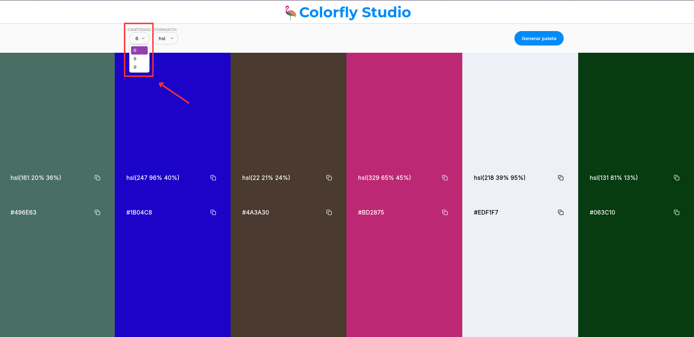

### 2. Seleccionar formato a generar
Seleccionar una de las 2 opciones existenes (hsl, hex) del campo selector para 'formato' de la barra de configuración de la paleta (hsl por defecto).

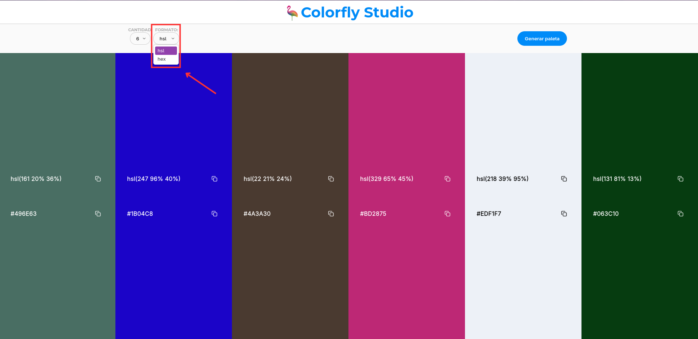

### 3. Generar paleta de colores
Hacer click en el botón 'Generar paleta' para generar paleta de colores en base a las opciones anteriormente elegidas.

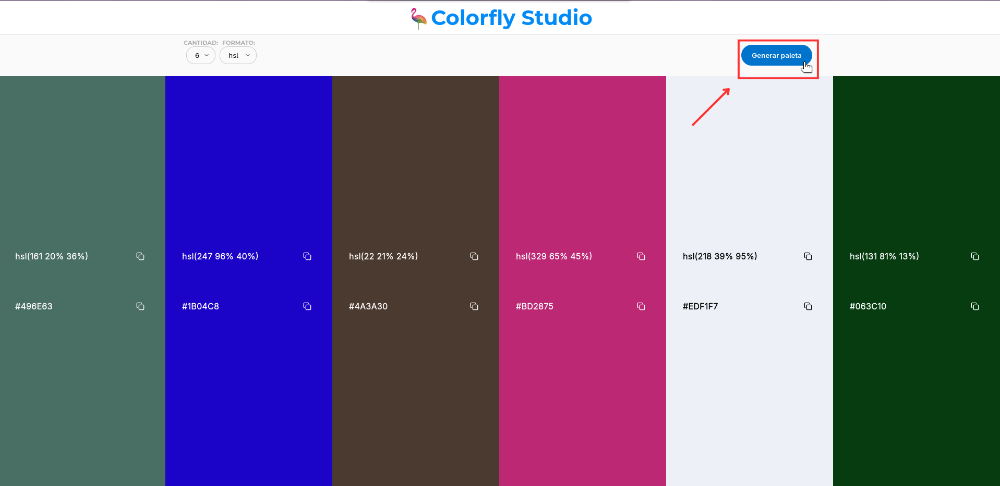

### 4. Copiar código de color al portapapeles
Para copiar el código de algún color generado al portapapeles, hacer click sobre el ícono ubicado a un costado del código del color generado.

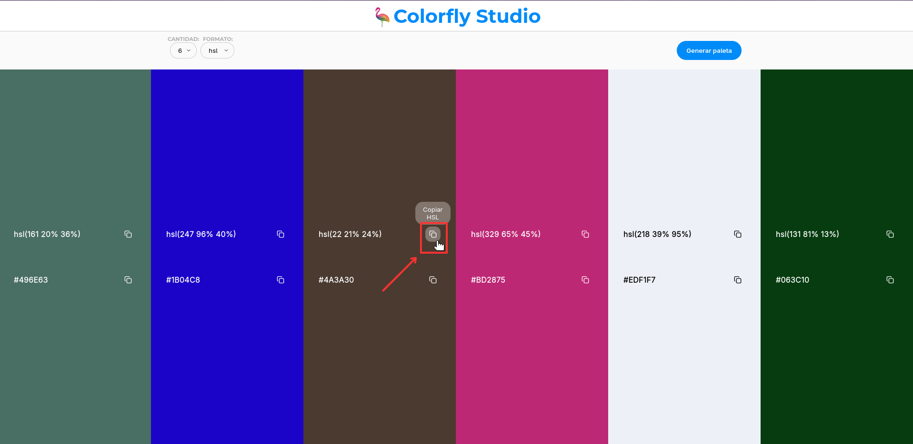

___

## Decisiones técnicas

### Tecnologías y Herramientas
- **HTML5, CSS3 y JavaScript (ES6+):** Desarrollo basado en estándares modernos para asegurar compatibilidad y rendimiento.
- [**Google Fonts:**]() Uso de las tipografías [*Montserrat*](https://fonts.google.com/specimen/Montserrat) (títulos) e [*Inter*](https://fonts.google.com/specimen/Inter) (cuerpo) para mejorar la legibilidad y estética visual.
- [**Lucide Icons:**](https://lucide.dev/icons/) Implementación de íconos vectoriales (SVG) para una interfaz limpia y escalable.

### Estructura del Proyecto
El proyecto sigue una estructura simplificada:

```text
ProyectoM1_FernandoPerezMojica/
├── index.html  # Estructura semántica de la aplicación.
├── style.css   # Estilos globales y adaptativos.
├── main.js     # Lógica de negocio, generación de colores y manipulación del DOM.
└── assets/     # Almacenamiento de recursos estáticos como imágenes e íconos.
```

### Implementaciones Clave
- **Enfoque Mobile First:** El diseño se desarrolló priorizando dispositivos móviles, utilizando *media queries* para adaptar la interfaz a pantallas más grandes (escritorio), optimizando así la experiencia de usuario en cualquier dispositivo.
- **Renderizado Dinámico:** Los elementos de la paleta se generan y renderizan mediante JavaScript en lugar de tener elementos ocultos en el HTML. Esto reduce la carga inicial del DOM y mejora la accesibilidad para lectores de pantalla.
- **Cálculo de Contraste Cromático:** Para garantizar la legibilidad, se implementó una lógica que detecta la luminancia del color generado:
  - En **HSL**, se evalúa el valor de *lightness* (l < 50% = color oscuro).
  - En **HEX**, se utiliza la fórmula de luminancia percibida.

  Si el color es detectado como "oscuro", se aplica automáticamente la clase `.es-oscuro` para cambiar el texto a blanco, asegurando un contraste adecuado según los estándares de accesibilidad.
- **Interacción y Feedback:** 
  - **Clipboard API:** Uso de `navigator.clipboard` para una copia eficiente y moderna de los códigos de color al portapapeles del dispositivo del usuario.
  - **Sistema de Toasts:** Implementación de notificaciones dinámicas con atributos `aria-live="polite"`, permitiendo que los usuarios de lectores de pantalla reciban confirmaciones de sus acciones sin interrumpir su flujo de navegación.

___

## Pasos para ejecutar la aplicación en local

### Opción 1: Descarga directa
1. Descargar el archivo ZIP desde el repositorio: [https://github.com/fermop/ProyectoM1_FernandoPerezMojica](https://github.com/fermop/ProyectoM1_FernandoPerezMojica). Hacer click en el botón verde 'Code' y posteriormente hacer click en 'Download ZIP'. Para una mejor referencia vea la siguiente imagen.

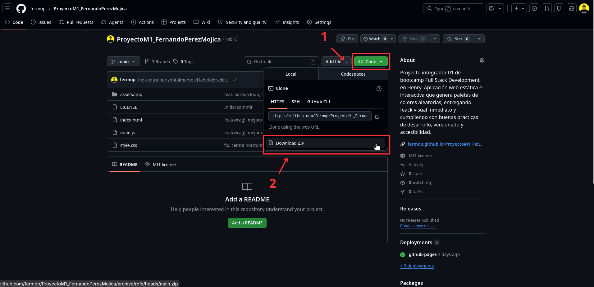

2. Extraer el contenido del archivo en una carpeta de su preferencia.

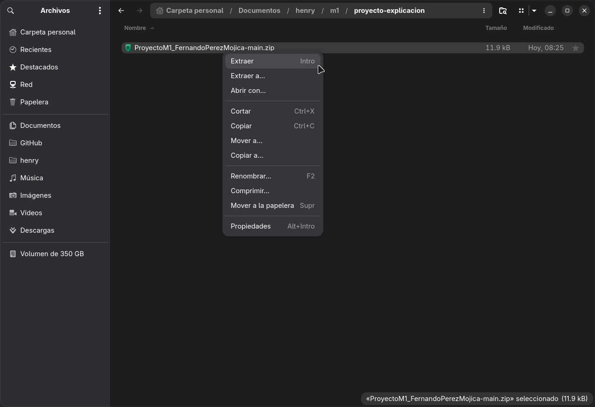

3. Una vez extraído el contenido del ZIP, localizar el archivo `index.html` y abrirlo con cualquier navegador web moderno.

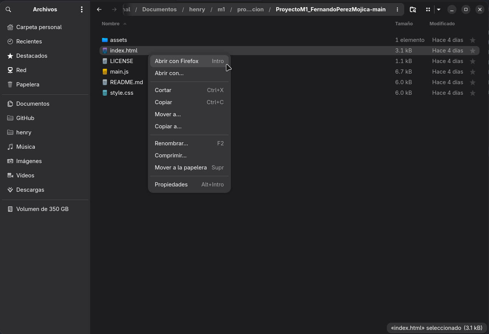

### Opción 2: Clonando el repositorio
Para esta opción, es indispensable tener instaladas las siguientes herramientas:
- [Git](https://git-scm.com/install/) - Sistema gestor de versiones
- [Visual Studio Code](https://code.visualstudio.com/Download) - Editor de código
- [Live Server](https://marketplace.visualstudio.com/items?itemName=ritwickdey.LiveServer) - Extensión de VS Code

En caso de no tener alguna de las mencionadas anteriormente, consultar la documentación oficial adjunta según sea su sistema operativo.

1. Clonar el repositorio en una carpeta de su preferencia, ejecutando el siguiente comando en la terminal:
   ```bash
   git clone https://github.com/fermop/ProyectoM1_FernandoPerezMojica.git
   ```
2. Abrir la carpeta del proyecto utilizando [Visual Studio Code](https://code.visualstudio.com/).

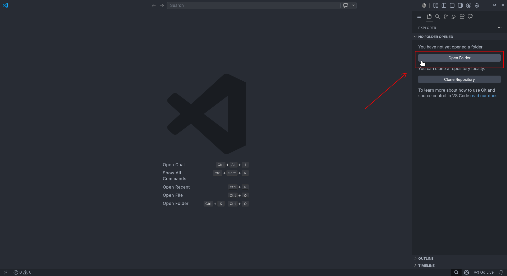

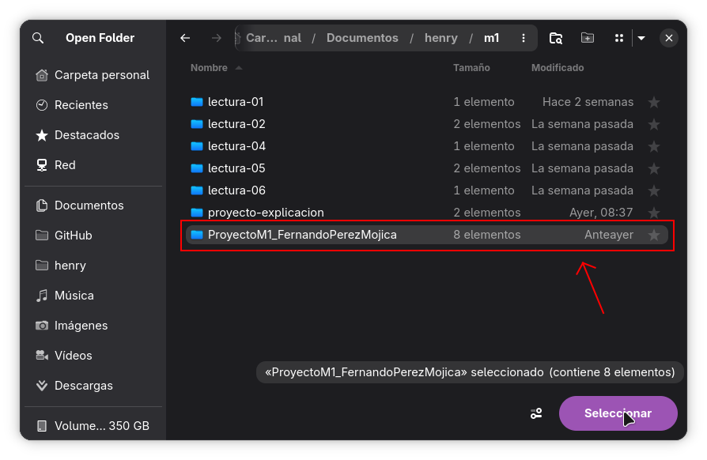

3. Para visualizar los cambios en tiempo real, una vez instalada la extensión [Live Server](https://marketplace.visualstudio.com/items?itemName=ritwickdey.LiveServer) en el editor de código VS Code, hacer clic derecho sobre `index.html` y seleccionar **"Open with Live Server"**.

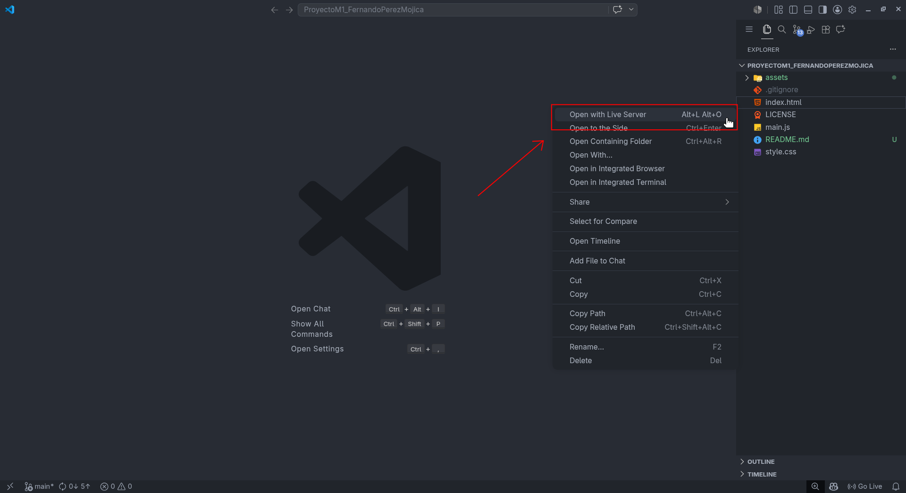
___

## Pasos para desplegar la aplicación en GitHub

Para publicar el proyecto y hacerlo accesible en la web, utilizaremos [GitHub Pages](https://pages.github.com/). Sigue estos pasos:

### 1. Crear una cuenta en GitHub
Si aún no tienes una, dirígete a [github.com](https://github.com/) y regístrate siguiendo los pasos indicados en la plataforma.

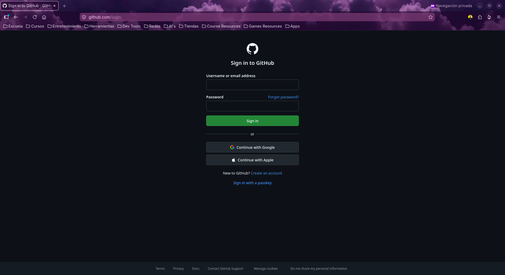

### 2. Crear un nuevo repositorio
Una vez iniciada la sesión, crea un nuevo repositorio haciendo clic en el botón "New" en tu perfil. Dale un nombre, elige la visibilidad (debe ser "Public" para GitHub Pages en cuentas gratuitas) y haz clic en "Create repository".

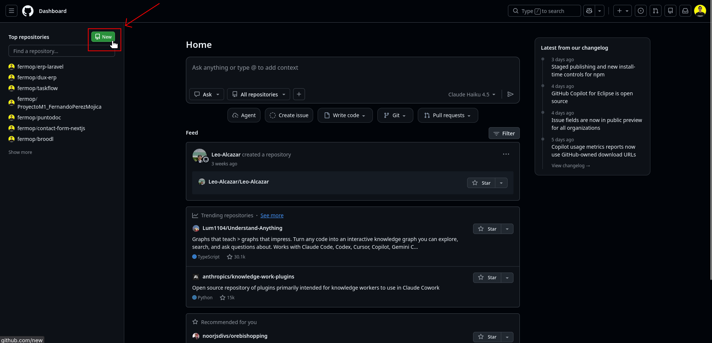

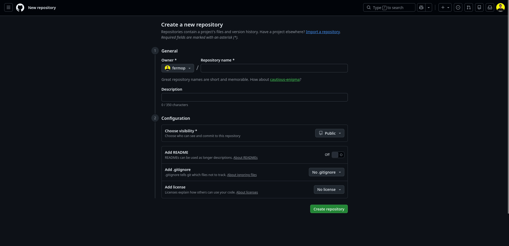

### 3. Subir el proyecto
Sube tu proyecto local mediante `git push` desde la terminal siguiendo las instrucciones que aparecen en pantalla al crear el repo, o arrastrando los archivos manualmente a la interfaz de GitHub ("upload an existing file"). Asegúrate de que el archivo `index.html` esté en la carpeta raíz.

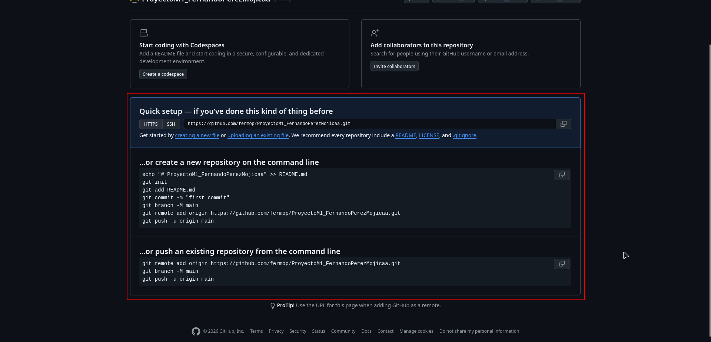

### 4. Configurar GitHub Pages
1. Ve a la pestaña **Settings** de tu repositorio.
2. En el menú de la izquierda, busca la sección **Pages**.
3. En "Build and deployment", selecciona en "Source" la opción "Deploy from a branch".
4. En "Branch", elige la rama `main` (o `master`) y la carpeta `/(root)`. Haz clic en **Save**.

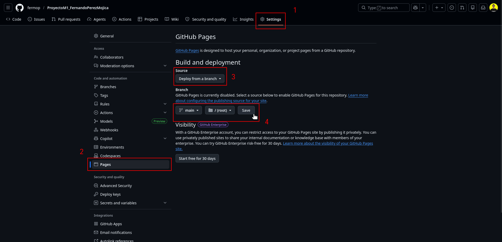

### 5. Ver el sitio publicado
GitHub tardará unos minutos en construir tu sitio. Después de un breve periodo, verás un mensaje en la parte superior de la página **Pages** indicando que tu sitio está publicado, junto con la URL correspondiente.

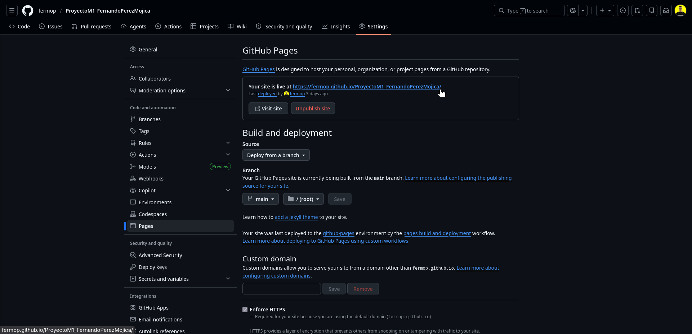

## Fuentes útiles
- [Create a Tooltip Using CSS attr Function | Quick Tooltip With HTML & CSS](https://youtu.be/p0KNlL5jjeA?si=EusPgIwxhTxFGXx2)
- [How To Make Custom Toast Notification in JavaScript | Step-by-Step For Beginners](https://youtu.be/-05WDtWEHRA?si=ziaIGBimWVB9E4WW)